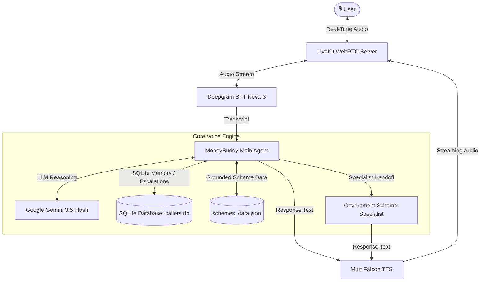

# MoneyBuddy — Indian Financial Services AI Voice Assistant

**MoneyBuddy** is a production-grade, multi-agent AI voice assistant built for the **10 Days of Voice Agents — VoiceForBharat Edition**. Powered by **Murf Falcon TTS** for ultra-low latency speech synthesis, **LiveKit WebRTC** for real-time audio transport, **Deepgram Nova-3** for multilingual Speech-to-Text, and **Google Gemini** for LLM reasoning.

MoneyBuddy educates Indian citizens on government financial schemes, promotes digital banking safety, prevents fraud, manages persistent caller memory, executes human escalations, tracks call metrics, and performs multi-agent specialist handoffs.

[](https://opensource.org/licenses/MIT) [](https://murf.ai/api/docs/text-to-speech/streaming) [](https://docs.livekit.io) [](https://www.typescriptlang.org/) [](https://www.python.org/)

---

## 🚀 Why Murf Falcon

- **55ms Model Latency**: Industry-leading ultra-fast TTS streaming.
- **130ms Time-to-First-Audio**: Instant voice responsiveness across global regions.
- **150+ Voices & 35+ Languages**: High-quality regional Indian voices (`Anisha`, `Pooja`, `Kabir`).
- **99.38% Pronunciation Accuracy**: Precise domain-specific financial terminology synthesis.

---

## 🏗️ Architecture



---

## 📅 10 Days Challenge — Step-by-Step Progress (Days 1–9)

### 🔹 Day 1: Foundation & Voice AI Pipeline Setup
- **Track Selected**: Financial Services track for Indian Citizens.
- **Voice Pipeline**: LiveKit session configured with Deepgram STT (`nova-3`), Google Gemini (`gemini-3.5-flash`), Silero VAD, and **Murf Falcon TTS** using Indian voices (`Pooja` / `Anisha`, `en-IN`).
- **Concurrency & Prewarming**: Worker process prewarming for Silero VAD to ensure instantaneous turn-taking.

### 🔹 Day 2: Persona, Guardrails & Red Team Security
- **Financial Advisor Persona**: System prompt defined in `backend/src/prompt.py` for educating callers on government schemes and digital banking safety.
- **Strict Financial Guardrails**: Enforced safety rules preventing requests for OTPs, UPI PINs, banking passwords, CVVs, or full card/account numbers, and barring false approval promises.
- **Multilingual Support**: Dynamic Hinglish keyword detection and script-matching voice updates (`hi-IN-anisha` vs `en-IN-anisha`).
- **Red Team Evaluation**: Comprehensive security evaluation suite (`RED_TEAM.md`) covering 10 attack and vulnerability scenarios, all verified PASS.

### 🔹 Day 3: Financial Services Frontend & UI State Indicators
- **Financial Services UI Theme**: Modern Next.js frontend styled with custom emerald/teal theme and accessible typography.
- **Voice State Indicators**: Real-time visual indicator badges mapping `Ready`, `Connecting`, `Listening`, `Speaking`, and `Call Ended` states.
- **Microphone Fallback**: Helpful browser permission error dialog with step-by-step unblocking guide.
- **Live Transcript & Localization**: Real-time auto-scrolling conversation transcript panel with speaker separation and full English / Hindi (हिंदी) / Hinglish interface dictionary.

### 🔹 Day 4: Persistent SQLite Caller Memory & Privacy Safeguards
- **Persistent Database**: SQLite storage (`callers.db`) saving caller profile (`user_id`, `name`, `language_preference`, `facts`, `last_interaction`).
- **PII & Credential Sanitization**: `sanitize_facts()` function scrubbing sensitive parameters (account numbers, card numbers, Aadhaar, PAN, PINs, OTPs) prior to database insertion.
- **Function Tools & Consent**: Agent tools `lookup_caller` and `save_user_facts` requiring explicit caller permission before storing facts.
- **Personalized Greetings**: Returning callers recognized and greeted warmly by name upon reconnecting.

### 🔹 Day 5: Grounded Domain Data Source & Fallback Policy
- **Grounded Scheme Dataset**: Curated local dataset (`backend/src/schemes_data.json`) covering official Indian government schemes (PM Kisan Samman Nidhi, PM Suraksha Bima Yojana, PM Jeevan Jyoti Bima Yojana, APY, PMMY).
- **Domain Function Tool**: `lookup_financial_scheme` tool returning eligibility criteria, benefits, and required document checklists.
- **Timestamp Transparency**: Spoken transparency included in responses (*"Based on our database updated yesterday..."*).
- **Graceful Spoken Fallback**: Polite apology delivered if the scheme database becomes unreadable or offline, preventing hallucinations.

### 🔹 Day 6: Outbound Telephony & Campaign Management
- **LiveKit SIP Outbound Script**: Automated telephony script (`backend/src/outbound.py`) triggering SIP outbound calls over LiveKit trunks.
- **Outbound Use Case**: Scheme deadline reminders (e.g., PM Kisan eKYC deadline).
- **Outbound Opening Protocol**: Immediate opening greeting clearly stating caller identity (**MoneyBuddy**), call purpose, and providing an explicit opt-out path.

### 🔹 Day 7: Human Escalation Ticket System & Emergency Workflows
- **Emergency Escalation Situations**: Triggers for 1) Possible fraud/unauthorized activity, and 2) Lost/stolen credit or debit cards.
- **Escalation Tool (`create_escalation`)**: Generates sequential ticket reference IDs (`MB-YYYYMMDD-XXX`), records ticket details in SQLite, deduplicates open tickets, and redacts PII.
- **Caller Consent**: Explicit consent requested before creating an escalation. If denied, conversation continues normally.
- **Discord Integration**: Optional real-time Discord webhook notifications (`DISCORD_HUMAN_SUPPORT_WEBHOOK_URL`) dispatched for high/emergency urgency tickets.

### 🔹 Day 8: Call Analytics Dashboard & Metric Tracking
- **Call Outcome Classification**: Automatic categorization of call sessions as `successful` or `failed`.
- **Categorized Failure Tracking**: Detailed breakdown of failure types (`user_declined`, `incomplete_task`, `tool_failure`, `api_error`, `no_response`, `user_hangup`).
- **End-to-End Latency Tracking**: Real-time measurement of voice latency (user speech ending to agent speech start) logged per turn and averaged.
- **Analytics Dashboard**: Dedicated Web Dashboard (`/analytics`) rendering total call counts, success rates, latency trends, and call history logs while strictly protecting PII and raw transcripts.

### 🔹 Day 9: Multi-Agent Architecture & Specialist Handoff
- **Government Scheme Specialist**: Dedicated specialist agent (`specialist.py`) with distinct persona (`SCHEME_SPECIALIST_PROMPT`) and male Indian voice (`Kabir`, `hi-IN-kabir` / `en-IN-kabir`).
- **Agent Handoff Tool (`transfer_to_scheme_specialist`)**: Main agent tool transferring control to the specialist upon scheme-specific requests.
- **Spoken Handoff Announcement**: MoneyBuddy informs the caller before switching (*"Connecting you to our government scheme specialist now."*).
- **Hand-Back Tool (`transfer_back_to_moneybuddy`)**: Specialist returns control to MoneyBuddy when the scheme task completes or the caller changes topic.
- **Fallback Resilience**: Graceful fallback preserves main agent control if specialist initialization fails.
- **Routing Evaluation Suite**: 14-test verification suite (`test_day9_routing.py`) verifying routing across banking, fraud, card loss, scheme queries, human help, and opt-outs.

---

## 🛠️ Quickstart

### Prerequisites

- **Python** 3.10+
- **[uv](https://docs.astral.sh/uv/)**: Fast Python package manager
  ```bash
  # Windows (PowerShell)
  powershell -ExecutionPolicy ByPass -c "irm https://astral.sh/uv/install.ps1 | iex"
  ```
- **Node.js** 18+ & **pnpm**:
  ```bash
  npm install -g pnpm
  ```
- **LiveKit Cloud** account or local LiveKit server executable.

### 1. Environment Configuration

Create `.env.local` in both `backend/` and `frontend/`:

```env
LIVEKIT_URL=wss://your-livekit-project.livekit.cloud
LIVEKIT_API_KEY=your-api-key
LIVEKIT_API_SECRET=your-api-secret
MURF_API_KEY=your-murf-api-key
DEEPGRAM_API_KEY=your-deepgram-api-key
GOOGLE_API_KEY=your-google-gemini-api-key
```

### 2. Install Dependencies

```bash
# Backend
cd backend
uv sync
uv run python src/agent.py download-files

# Frontend
cd ../frontend
pnpm install
```

### 3. Run the Application

**Option A — All-in-One Script (Windows PowerShell):**
```powershell
.\start_app.ps1
```

**Option B — Separate Terminals:**
```powershell
# Terminal 1 — LiveKit Server (if local)
.\livekit-server.exe --dev

# Terminal 2 — Backend Agent
cd backend
uv run python src/agent.py dev

# Terminal 3 — Frontend UI
cd frontend
pnpm dev
```

Open **http://localhost:3000** in your browser.

---

## 🧪 Test Suite & Verification

MoneyBuddy includes an extensive test suite covering behavioral rules, memory persistence, escalation ticketing, analytics calculations, and multi-agent routing.

```bash
cd backend

# Run pytest unit tests
uv run pytest tests

# Run comprehensive behavioral test suite (16 tests)
uv run python tests/test_behavioral.py

# Run Day 9 routing and specialist handoff test suite (14 tests)
uv run python tests/test_day9_routing.py
```

---

## 📁 Project Structure

```
murf-livekit-starter/
├── backend/
│   ├── src/
│   │   ├── agent.py               # Entrypoint & main MoneyBuddy agent session pipeline
│   │   ├── specialist.py          # Day 9 Government Scheme Specialist agent & handoff logic
│   │   ├── prompt.py              # MoneyBuddy system prompt & guardrails
│   │   ├── specialist_prompt.py   # Scheme Specialist system prompt
│   │   ├── db.py                  # SQLite database (callers memory, escalations, analytics calls)
│   │   ├── schemes_data.json      # Grounded domain dataset for Indian financial schemes
│   │   ├── outbound.py            # LiveKit SIP outbound calling script
│   │   └── dashboard.py           # Standalone HTTP analytics & escalation status dashboard
│   ├── tests/
│   │   ├── test_agent.py          # Pytest session tests
│   │   ├── test_behavioral.py     # 16 behavioral test scenarios (Days 4-8)
│   │   ├── test_day9_routing.py   # 14 routing & specialist handoff tests (Day 9)
│   │   └── test_tts_handoff.py    # TTS handoff unit tests
│   ├── .env.example
│   └── pyproject.toml
├── frontend/
│   ├── app/
│   │   ├── page.tsx               # Main voice UI page
│   │   ├── analytics/page.tsx     # Real-time Call Analytics Dashboard
│   │   ├── escalations/page.tsx   # Human Escalation Ticket Dashboard
│   │   └── api/                   # Token & Analytics REST endpoints
│   ├── components/
│   │   ├── app/                   # WebRTC session & view controllers
│   │   └── moneybuddy/            # Avatar, status indicators, transcript, language selectors
│   ├── app-config.ts              # MoneyBuddy branding & features config
│   └── package.json
├── RED_TEAM.md                    # Day 2 Red Team security evaluation report (10 test cases)
├── start_app.ps1                  # All-in-one launch script for Windows
├── start_app.sh                   # All-in-one launch script for Linux/macOS
└── README.md                      # Project documentation
```

---

## 📄 License

Distributed under the **MIT License**. See `LICENSE` for details.
